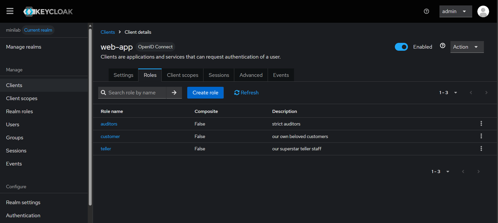
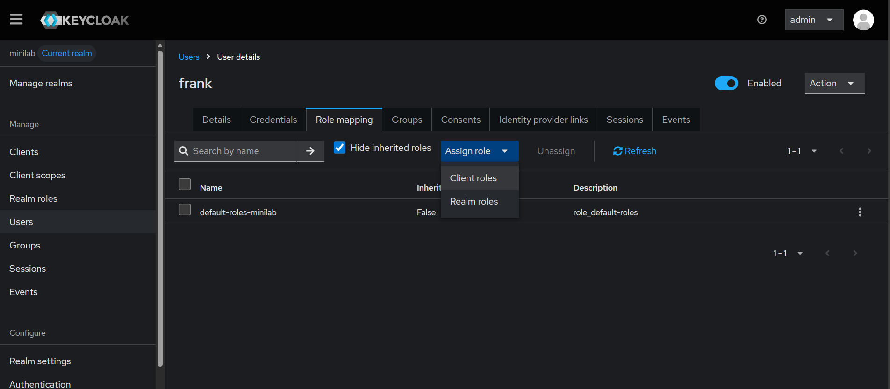

# RBAC 

Let's start by adding the roles inside the client. Be careful we aren't using the Realm Role (or global role) instead we are using a client role.



For the shake of simplicity we are using just three roles 

* customer: Customer are allowded to transfer balance, read account balance

* teller: Teller are allowded to read account balance only


We can now assign these roles to the users. 



The role should be now part of the access token. 

If we re-login with the user that we have assigned roles we should see 

```json
 "resource_access": {
    "web-app": {
      "roles": [
        "teller"
      ]
    },
```
Now, we got the roles we can now map that in a enforcement in our node.js server API 

```js
  const roles = jwt.decode(token)?.resource_access?.[KEYCLOAK_CLIENT_ID]?.roles || 

  if (!roles.includes("customer")) {
    return res.status(403).json({ error: "INSUFFICIENT_ROLE" });
  }
```

With these checks we can enforce permission on the node.js client. 


