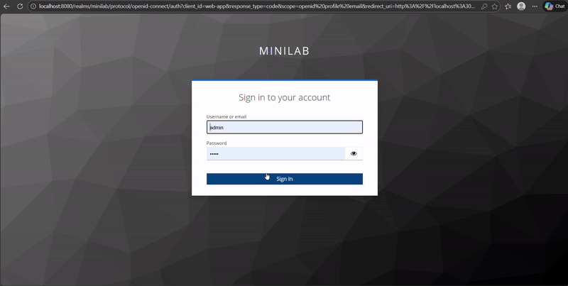

# RBAC 

Let's start by adding the roles inside the client. Be careful we aren't using the Realm Role (or global role) instead we are using a client role.


For the shake of simplicity we are using just three roles 

* customer: Customer are allowded to transfer balance, read account balance

* teller: Teller are allowded to read account balance only


We can now assign these roles to the users. 


The role should be now part of the access token. 

If we re-login with the user that we have assigned roles we should see 

```json
 "resource_access": {
    "web-app": {
      "roles": [
        "teller"
      ]
    },
```
Now, we got the roles we can now map that in a enforcement in our node.js server API 

```js
  const roles = jwt.decode(token)?.resource_access?.[KEYCLOAK_CLIENT_ID]?.roles || 

  if (!roles.includes("customer")) {
    return res.status(403).json({ error: "INSUFFICIENT_ROLE" });
  }
```

With these checks we can enforce permission on the node.js client. 

For the simple RBAC we have set role based dashboard: 
* if the user is customer he can see the customer dashboard and perform transactions 
* if the user is teller he can see all customer balances but can't perform transcations.

```js
 if (roles.includes("teller") && !req.query.user) {
        return res.redirect("/teller")
    }

    // allow customer + teller to view the dashboard UI
    if (!roles.includes("customer") && !roles.includes("teller")) {
        return res.status(403).render("unauthorized");
    }
```

Teller Landing Page with RBAC imposed in a API layer 

```js 
  const roles = getUserRoles(req);

  if (!roles.includes("customer")) {
    req.session.transferAllowed = false;
    req.session.pendingTransfer = null;
    return res.status(403).render("unauthorized");
  }
```


Customer Landing on Dashboard and allowded to perform the transaction

